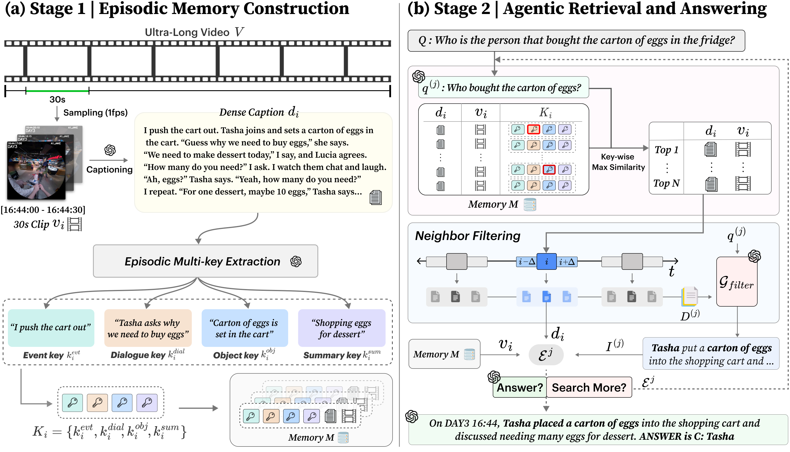

<h1 align="center">🔑 <i>Keep It Simple:</i> Multi-Key Episodic Memory Retrieval for Ultra-Long Video Understanding</h1>

<h3 align="center">
  <b>ECCV 2026</b> &nbsp;·&nbsp; Long Oral 🔥
</h3>

<p align="center">
  <a href="https://choi-yeeun.github.io">Yeeun Choi</a><sup>1</sup> &nbsp;·&nbsp;
  <a href="https://sites.google.com/view/youngbeomyoo/home">Youngbeom Yoo</a><sup>1</sup> &nbsp;·&nbsp;
  <a href="https://joonyoung-cv.github.io/">Joon-Young Lee</a><sup>2</sup> &nbsp;·&nbsp;
  <a href="https://sites.google.com/view/hyolim">Hyolim Kang</a><sup>1,†</sup> &nbsp;·&nbsp;
  <a href="https://www.ciplab.kr/members/professor">Seon Joo Kim</a><sup>1,†</sup>
</p>

<p align="center">
  <sup>1</sup> Yonsei University &nbsp;&nbsp;&nbsp; <sup>2</sup> Adobe Research
</p>

<p align="center">
  <a href="https://arxiv.org/abs/2608.07663"></a>
  &nbsp;
  <a href="https://choi-yeeun.github.io/MERIT/"></a>
  &nbsp;
  <a href="assets/merit_poster.pdf"></a>
  &nbsp;
  <a href="https://www.youtube.com/watch?v=s1owGshMbAg"></a>
  &nbsp;
  <a href="https://www.python.org/downloads/release/python-3110/"></a>
</p>

---

<p align="center">
  <b>MERIT</b> = <b>M</b>ulti-key <b>E</b>pisodic <b>R</b>etrieval with <b>I</b>nference-time <b>T</b>emporal expansion
</p>

MERIT answers questions about day-scale video by keeping the memory simple and
deferring semantic composition to query time. The memory is a flat key–value
index built from dense captions: four complementary keys per 30-second clip.
At inference, neighbor filtering expands each retrieved clip into its
surrounding context and distills the evidence the question actually needs.

<p align="center">
  
</p>

**Stage 1 — Episodic memory construction.** Each 30-second clip is densely
captioned, then a multi-key extraction derives four keys per clip, forming a
lightweight key–value memory.

**Stage 2 — Agentic retrieval and answering.** The solver regenerates a query,
matches it against the keys by key-wise max similarity to retrieve clips, and
neighbor filtering expands the temporal context to distill query-relevant
evidence for the final answer.

## ⚙️ Get Started

Python 3.11, CUDA 12.x, PyTorch 2.6.0.

```bash
bash setup_env.sh             # micromamba + uv; MERIT_CUDA=cu121 for CUDA 12.1
micromamba activate merit
cp .env.example .env          # OPENAI_API_KEY
```

With Docker instead:

```bash
bash docker/build.sh          # merit:1.0
cp .env.example .env
bash docker/run.sh            # shell in /workspace
```

`OPENAI_API_KEY` is required for `gpt-*` models, `GOOGLE_API_KEY` /
`VERTEX_API_KEY` only for `gemini-*`. Keys are read from the environment and are
never written into the repo or the image.

> [!TIP]
> Two checks before a long run. `python tools/check_runtime.py` reports GPUs,
> installed versions, egress and free disk on the machine you are about to run
> on; `python tools/check_egolife_data.py` verifies the data layout below,
> including that the clips actually resolve.

## 🎞️ EgoLifeQA

Download [lmms-lab/EgoLife](https://huggingface.co/datasets/lmms-lab/EgoLife)
and put (or symlink) it so that this exists:

```
data/EgoLife/
├── EgoLifeQA/EgoLifeQA_A1_JAKE.json
├── captions/A1_JAKE/A1_JAKE_30sec_4_key.json
└── videos/A1_JAKE/DAY<n>/*.mp4
```

If the dataset lives elsewhere, point `--qa-file` and `--video-root` at it
instead.

### Preprocessing

The four retrieval keys are extracted from 30-second dense captions. We reuse
the captions released by [WorldMM](https://github.com/wgcyeo/WorldMM); you can
take those as well, or produce your own by following their captioning
procedure. Either way, put them at
`data/EgoLife/captions/A1_JAKE/A1_JAKE_30sec.json` and run:

```bash
bash script/extract_keys_egolife.sh \
    --subject A1_JAKE \
    --model gpt-5-mini \
    --concurrency 20
```

The extracted keys ship with this repo, so this step is *only needed to
regenerate them with a different model or prompt*.

### Evaluation

```bash
bash script/eval_egolife.sh \
    --exp-name merit_gpt5_top10 \
    --respond-model gpt-5 \
    --top-k 10 --max-rounds 5 --image-max-tokens 512 \
    --num-workers 4 --num-threads 1 --gpu-ids 0,1,2,3 \
    --service-tier flex --timeout 600
```

```bash
bash script/eval_egolife.sh \
    --exp-name merit_qwen3vl8b_top5 \
    --respond-model qwen3vl-8b \
    --top-k 5 --max-rounds 5 --image-max-tokens 512 \
    --num-workers 4 --gpu-ids 0,1,2,3
```

```bash
python eval/score_egolife.py    output/<exp-name>/<exp-name>_final.json
python eval/hit_rate_egolife.py output/<exp-name>/<exp-name>_final.json --margin-clips 2
```

> [!TIP]
> On the first run the four keys of every clip are embedded on CPU and cached
> under `.cache/multi_keys/<subject>/`. Later runs reuse the cache, including
> across models.

The seed is fixed, but FlashAttention selects kernels per GPU architecture, and
the resulting numerical differences can flip a borderline choice. Ours were run
on 4× A100.

## 📼 Video-MME

Put the videos, `test_qa.json` and the subtitles from the
[official release](https://huggingface.co/datasets/lmms-lab/Video-MME) under
`benchmarks/videomme/data/`.

### Preprocessing

```bash
cd benchmarks/videomme

python preprocess/sample_frames.py --num_workers 32          # -> data/frames
python preprocess/caption_clips.py --concurrency 30 --flex   # -> data/captions
python preprocess/extract_keys.py  --concurrency 30 --flex   # -> data/keys
```

Frame sampling needs `ffmpeg`; captioning and key extraction need
`OPENAI_API_KEY`.

### Evaluation

```bash
bash script/eval_videomme.sh \
    --exp-name merit_gpt5_top10 \
    --respond-model gpt-5 \
    --top-k 10 --max-rounds 5 --image-max-tokens 512 \
    --service-tier flex --timeout 600 --resume
```

## 🎬 LVBench

LVBench has no subtitles, so retrieval uses three keys (event, object,
summary). Put the videos and `video_info.meta.jsonl` from the
[official repo](https://github.com/zai-org/LVBench) under
`benchmarks/lvbench/data/`.

### Preprocessing

```bash
cd benchmarks/lvbench

python preprocess/sample_frames.py --num_workers 32
python preprocess/caption_clips.py --concurrency 30 --flex
python preprocess/extract_keys.py  --concurrency 30 --flex
```

### Evaluation

```bash
bash script/eval_lvbench.sh \
    --exp-name merit_gpt5_top10 \
    --respond-model gpt-5 \
    --top-k 10 --max-rounds 5 --image-max-tokens 512 \
    --service-tier flex --timeout 600 --resume
```

## 🗂️ Layout

```
MERIT/
├── src/merit/                # shared library
│   ├── merit_memory.py       # MeritMemory — search / filter / answer rounds
│   ├── multikey_memory.py    # MultiKeyMemory — key embeddings + MaxSim retrieval
│   ├── embedding/  llm/      # model wrappers and the prompt templates
│   └── types.py  eval_utils.py
├── preprocess/               # retrieval-key extraction
├── eval/                     # evaluation driver, scoring, hit rate
├── script/                   # shell wrappers
├── tools/                    # setup checks
├── benchmarks/
│   ├── videomme/             # preprocess/ eval/ script/ src/ — same shape
│   └── lvbench/
├── docker/  setup_env.sh     # environment
└── data/
```

Runs create `output/<exp-name>/`, `.cache/` and `.log/`.

## 📝 Citation

If you find our work valuable, please cite:

```bibtex
@article{choi2026keep,
  title={Keep It Simple: Multi-Key Episodic Memory Retrieval for Ultra-Long Video Understanding},
  author={Choi, Yeeun and Yoo, Youngbeom and Lee, Joon-Young and Kang, Hyolim and Kim, Seon Joo},
  journal={arXiv preprint arXiv:2608.07663},
  year={2026}
}
```

(The ECCV 2026 proceedings BibTeX will replace this arXiv entry once available.)

## 🙏 Acknowledgments

MERIT builds on [WorldMM](https://github.com/wgcyeo/WorldMM), our baseline. We
thank the authors for open-sourcing the EgoLife captions and the preprocessing
pipeline our experiments rest on. We are also grateful to the authors of
[EgoLife](https://github.com/EvolvingLMMs-Lab/EgoLife),
[Video-MME](https://github.com/BradyFU/Video-MME) and
[LVBench](https://github.com/zai-org/LVBench) for building and releasing the
datasets, benchmarks and evaluation protocols this work is measured on.
